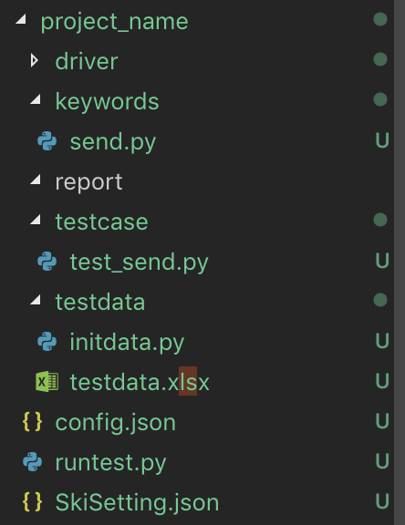
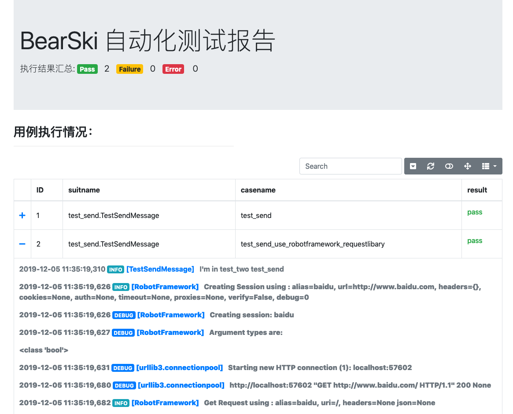

# BearSki 自动化测试框架

## 简介
BearSki 是一个自动化测试的基础框架。核心采用关键字驱动、MBT、自动化测试分层思想。提供项目在自动化测试应用中遇到的一些通用问题的解决方案。从而降低测试用例编写难度，提升自动化测试用例的可维护性。
帮助测试人员构建属于自己的测试工具集，可以同时支持api接口自动化测试、web页面自动化测试、app终端自动化测试、AI测试等。


## 功能清单
#### 【已完成】
* 基于unittest编辑测试用例的编辑，提供基于关键字驱动的测试步骤书写方法 ；
* 封装 RobotFramework 的驱动调用方法，可以直接调用 rf 的驱动类执行相关测试；
* 提供命令行及配置文件的用例执行调用方式；
* 提供统一的日志输出；
* 提供基于Bootstrap-table 单文件测试报告。
* 基于har文件的接口自动化测试，测试模型、测试数据、测试用例的自动生成功能
* 基于数据表的测试数据管理功能；
#### 【待开发】
* 通用结果过滤器；
* 用例、关键字、测试数据测试执行监控功能。
## 快速开始
1、安装
```bash
pip install BearSki
```
2、生成测试项目
执行如下命令
```bash
BearSki createproject -n "project_name"
```
可以看到如下提示
```bash
siriusdeMacBook:dist sirius$ BearSki createproject -n "project_name"
完成测试项目创建：project_name
```
查看项目目录，如下目录：


目录说明：
* **driver** ：驱动层代码，用于放置对接各种自动化测试工具代码
* **keywords**： 关键字驱动代码，用于保存业务层关键字驱动代码，测试用例中测试步骤ski.step("keywordsname",data)通过对应业务关键字在 SkiSeting.json 配置 反正到对应代码。
* **testcase** ：具体测试用例保存地址用例文件名。
* **estdata** ：测试数据、数据表、测试模型 保存在这个例。框架会默认执行 initdata.py中初始化（initData）和环境清理（clear）中的方法。初始化测试数据和清理测试数据。
* **report** ：单机版测试报告保存在这里。通过config.json中的配置可以设置是否通过执行时间区分测试报告。

* **config.json**：测试项目运行环境相关的基础配置信息，如测试用例文件夹路径，测试用例报告输出形式、单用例执行/多用例执行
* **SkiSeting.json**:测试用例相关配置信息，如：关键字信息、测试数据获取信息（本地excel、数据库链接信息、数据池接口信息）、日志配置 等

3、控制台输出模式执行用例
```bash
src sirius$ cd project_name
testproject sirius$ python runtest.py 
```
4、测试报告模式执行用例
```bash
testproject sirius$ python runtest.py -f config.json
```

5、查看测试报告


## 问题交流与反馈
邮箱：chen6_9@163.com 或在github上直接题问题单


